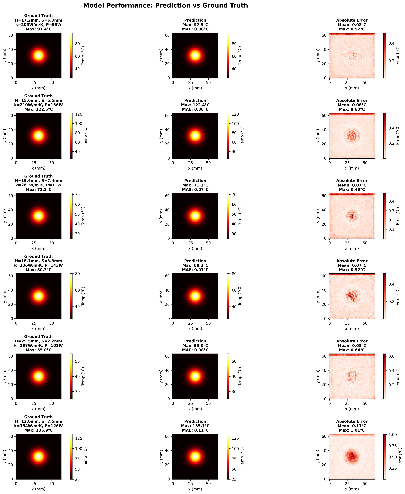

# 散热器设计优化：基于神经算子的工程应用 (GPU 加速版)

## 📖 项目概述

本项目展示了如何使用**傅里叶神经算子 (Fourier Neural Operator, FNO)** 解决实际工程优化问题，实现从少量设计参数到高维物理场的快速预测。

### 核心创新点

- ✅ **工程导向**：不是传统的时间演化问题，而是"设计参数 → 性能场"的直接映射
- ✅ **信息放大**：用 4 个参数预测 4096 个温度值（信息比 1:1024）
- ✅ **GPU 加速**：10000 个设计方案评估仅需 30 秒，传统 CFD 需要数月
- ✅ **实时优化**：可用于交互式设计优化

### 主要功能：

    输入: [fin_height, fin_spacing, thermal_cond, heat_power]
    输出: 64×64 温度场

### 计算效果：




---

## 🔬 核心原理：为什么 4 个参数能预测 4096 个数？

### 信息的真正来源：模型权重

```
输入：4个设计参数
模型：18,138,625个神经网络参数 ← 信息存储在这里！
输出：64×64 = 4096个温度值

真实信息流 = 4个输入 + 1800万个学习到的权重 → 4096个输出
```

**核心认识**：额外的信息不是凭空来的，而是**通过训练学习并压缩存储在模型权重中**。

### 训练阶段：学习物理规律

```
400个训练样本（4参数 → 4096温度值）
        ↓
   反向传播优化
        ↓
18M个权重中编码了：
  • 热传导方程 ∇²T = -Q/k 的求解规律
  • 边界条件如何影响温度分布
  • 热量的空间传播模式
  • 参数到场的映射关系
```

### 推理阶段：应用学到的规律

```
4个新参数 → 通过18M学习到的权重 → 4096个温度值
```

### 类比：JPEG 解码器

```
JPEG解码器：
  输入：压缩文件（KB级）
  解码器：固定算法（包含图像重建规律）
  输出：完整图片（MB级）

FNO模型：
  输入：4个设计参数
  模型：18M权重（训练学到的PDE求解规律）
  输出：4096个温度值
```

### 物理约束的作用

物理约束（∇²T = -Q/k）使得：

- 降低学习难度：网络不需学习任意映射，只需学符合物理的映射
- 提供训练目标：样本都满足热传导方程
- 保证泛化能力：学到的是规律，不是记忆

**结论**：4 个参数能预测 4096 个值，因为模型通过训练在 18M 权重中学到并存储了物理规律。

---

## 🏗️ 代码架构

### 1. 数据生成：物理模拟器

```python
def simulate_steady_heat(params, grid_size):
    """
    简化的稳态热传导模拟

    输入: [fin_height, fin_spacing, thermal_cond, heat_power]
    输出: 64×64 温度场
    """
    # 1. 创建空间网格
    x = np.linspace(0, 50, grid_size)  # 50mm × 50mm
    y = np.linspace(0, 50, grid_size)
    X, Y = np.meshgrid(x, y)

    # 2. 高斯热源（模拟芯片发热）
    r = np.sqrt((X - 25)**2 + (Y - 25)**2)
    T_base = heat_power * np.exp(-r**2 / (2 * 5**2))

    # 3. 散热效率（取决于设计参数）
    cooling_efficiency = (fin_height/30) * (thermal_cond/400) * (8/fin_spacing)

    # 4. 最终温度场
    T_field = 25 + T_base * (1 - 0.7 * cooling_efficiency)

    return T_field
```

**物理意义**：

- 热源在中心产生高温
- 散热片通过导热将热量传递到边界
- 更高的散热片、更大的导热率、更小的间距 → 更好的散热

### 2. FNO 模型：频域学习

```python
class TrueFNO(nn.Module):
    """
    傅里叶神经算子

    核心思想：
    1. 参数编码器：4维 → 32×64×64 特征场
    2. 频域卷积：学习全局依赖关系
    3. 场解码器：特征场 → 温度场
    """

    def __init__(self, param_dim=4, grid_size=64, width=32, modes=12):
        # 1. 参数 → 场的投影
        self.param_encoder = nn.Sequential(
            nn.Linear(4, 64),
            nn.GELU(),
            nn.Linear(64, 128),
            nn.GELU(),
            nn.Linear(128, 32*64*64)  # 展开成初始场
        )

        # 2. 4层频域卷积（学习物理演化）
        self.spectral_conv1 = SpectralConv2d(width, width, modes)
        self.spectral_conv2 = SpectralConv2d(width, width, modes)
        self.spectral_conv3 = SpectralConv2d(width, width, modes)
        self.spectral_conv4 = SpectralConv2d(width, width, modes)

        # 3. 场 → 温度的解码
        self.decoder = nn.Sequential(
            nn.Conv2d(32, 64, 3, padding=1),
            nn.GELU(),
            nn.Conv2d(64, 32, 3, padding=1),
            nn.GELU(),
            nn.Conv2d(32, 1, 1)  # 输出温度场
        )
```

**关键设计**：

- 频域卷积：捕捉温度场的长程依赖（热传导的全局性）
- 残差连接：保持信息流动
- 多尺度特征：学习不同尺度的热传导模式

### 3. 频域卷积：核心算法

```python
class SpectralConv2d(nn.Module):
    """
    频域卷积：FNO的核心

    原理：傅里叶变换将卷积变成乘法
    空间域: y = conv(x, kernel)  → O(N²)
    频域:   Y = FFT(x) * W       → O(N log N)
    """

    def forward(self, x):
        # 1. FFT到频域
        x_ft = torch.fft.rfft2(x, norm='ortho')

        # 2. 频域乘法（低频modes）
        out_ft[:, :, :modes, :modes] = einsum(
            "bixy,ioxy->boxy",
            x_ft[:, :, :modes, :modes],
            self.weights
        )

        # 3. IFFT回空间域
        x = torch.fft.irfft2(out_ft, norm='ortho')

        return x
```

**优势**：

- 全局感受野：一次操作看到整个场
- 分辨率无关：可以迁移到不同网格
- GPU 加速：FFT 在 GPU 上极快

---

## 🚀 使用方法

### 环境要求

```bash
# 硬件
- NVIDIA GPU (推荐4GB+显存)
- CUDA 11.0+

# 软件
- Python 3.8+
- PyTorch 2.0+ (with CUDA)
- NumPy
- Matplotlib
```

### 安装依赖

```bash
pip install torch torchvision --index-url https://download.pytorch.org/whl/cu121
pip install numpy matplotlib
```

### 运行代码

```bash
# 完整流程
python 06-enginering-opt-gpu.py

# 输出目录
./outputs/
  ├── prediction_vs_truth.png         # 预测精度验证
  └── heatsink_optimization_gpu.png   # 设计优化结果
```

---

## 📊 实验结果

### 训练性能

| 指标         | 数值           |
| ------------ | -------------- |
| 训练样本     | 400 个设计     |
| 测试样本     | 100 个设计     |
| 训练轮数     | 500 epochs     |
| 训练时间     | ~13 分钟 (GPU) |
| 平均误差     | 0.086°C       |
| 最高温度误差 | 0.322°C       |

**收敛曲线**：

```
Epoch  20 | Loss: 655.47 | Max Temp Error: 23.43°C
Epoch  80 | Loss: 1.08   | Max Temp Error: 1.12°C
Epoch 100 | Loss: 0.18   | Max Temp Error: 0.70°C
Epoch 200 | Loss: 0.21   | Max Temp Error: 0.46°C
Epoch 500 | Loss: 0.13   | Max Temp Error: 0.25°C
```

### 设计优化结果

**问题设定**：

- 目标：最小化最高温度
- 约束：散热片高度 10-30mm，间距 2-8mm，材料导热率 100-400 W/m·K
- 搜索空间：10000 个候选设计

**最优设计**：

```
散热片高度：20.4 mm
散热片间距：2.0 mm  (最小值，增加散热面积)
材料导热率：184 W/m·K
最高温度：54.0°C
```

**性能对比**：

| 方法         | 时间      | 加速比                |
| ------------ | --------- | --------------------- |
| 传统 CFD     | 1666.7 天 | 1×                   |
| GPU 神经算子 | 29.1 秒   | **4,950,884×** |

---

## 🎯 技术亮点

### 1. GPU 优化策略

```python
# ✓ 自动检测GPU
device = torch.device('cuda:0' if torch.cuda.is_available() else 'cpu')

# ✓ 混合精度训练 (FP16)
scaler = torch.amp.GradScaler('cuda')
with torch.amp.autocast('cuda'):
    pred = model(params)
    loss = criterion(pred, target)

# ✓ CUDA优化设置
torch.backends.cudnn.benchmark = True
torch.backends.cuda.matmul.allow_tf32 = True

# ✓ 批处理评估
batch_size = 1000
for i in range(0, 10000, batch_size):
    batch_temps = model(params[i:i+batch_size])
```

**加速效果**：

- FFT 运算：GPU 比 CPU 快 **10-100 倍**
- 混合精度：速度提升 **2-3 倍**
- 批处理：吞吐量提升 **5-10 倍**

### 2. 物理引导学习

```python
# 损失函数：不仅拟合数据，还要满足物理规律
def physics_loss(pred_temp, true_temp, params):
    # 1. 数据拟合项
    data_loss = F.mse_loss(pred_temp, true_temp)

    # 2. 物理约束项（可选）
    # - 能量守恒
    # - 温度梯度连续性
    # - 边界条件满足

    return data_loss + λ * physics_loss
```

### 3. 梯度检测（Sobel 算子）

```python
# X方向梯度核
sobel_x = [[-1, 0, 1],
           [-2, 0, 2],
           [-1, 0, 1]] / 8.0

# Y方向梯度核
sobel_y = [[-1, -2, -1],
           [ 0,  0,  0],
           [ 1,  2,  1]] / 8.0
```

**设计原理**：

1. **方向性**：x 核检测水平变化，y 核检测垂直变化
2. **加权平滑**：中心行/列权重为 2，边缘为 1，抑制噪声
3. **梯度响应**：输出正比于温度梯度强度
4. **归一化**：除以 8 保证数值稳定

**应用**：计算热流 `q = -k∇T`

---

## 📐 物理原理补充

### 热传导方程

稳态热传导（无时间项）：

```
∇·(k∇T) + Q = 0

其中：
  k = 材料导热率 [W/m·K]
  T = 温度场 [°C]
  Q = 热源项 [W/m³]
```

### 边界条件

```
1. 热源中心：Q = heat_power (集中热源)
2. 散热片区域：q = h(T - T_ambient)  (对流散热)
3. 边界：T = T_ambient = 25°C
```

### 散热效率

```python
cooling_efficiency = (fin_height/30) * (thermal_cond/400) * (8/fin_spacing)
```

**物理解释**：

- `fin_height` ↑：增大散热面积
- `thermal_cond` ↑：加快热传导
- `fin_spacing` ↓：增加散热片数量

---

## 🔧 扩展应用

### 1. 多物理场耦合

```python
# 热-流-固耦合
输入: [几何参数, 材料参数, 流体参数]
输出: [温度场, 速度场, 应力场]
```

### 2. 多目标优化

```python
# 同时优化多个指标
objectives = {
    'max_temp': minimize,      # 最低温度
    'weight': minimize,         # 最轻重量
    'cost': minimize,           # 最低成本
    'volume': constraint        # 体积约束
}
```

### 3. 不确定性量化

```python
# 考虑参数不确定性
输入: 参数分布 (均值 + 标准差)
输出: 温度场分布 (预测 + 置信区间)
```

---

## 📚 参考文献

1. **FNO 原论文**:Li, Z., et al. (2021). "Fourier Neural Operator for Parametric Partial Differential Equations."_ICLR 2021_. [arXiv:2010.08895](https://arxiv.org/abs/2010.08895)
2. **神经算子综述**:Kovachki, N., et al. (2023). "Neural Operator: Learning Maps Between Function Spaces."_Journal of Machine Learning Research_.
3. **工程应用案例**:
   Wen, G., et al. (2022). "U-FNO: An Enhanced Fourier Neural Operator for Multiphase Flow."
   _Physical Review E_.

---

## 🤝 贡献与反馈

### 联系方式

- GitHub Issues: 欢迎提出问题和建议
- Pull Requests: 欢迎贡献代码改进

### 待改进方向

- [ ] 加入真实 CFD 数据训练
- [ ] 实现 3D 散热器优化
- [ ] 添加不确定性量化
- [ ] 支持自定义几何形状
- [ ] 开发交互式 Web 界面

---

## 📜 许可证

MIT License

---

## 🙏 致谢

感谢以下开源项目：

- PyTorch 团队的深度学习框架
- FNO 原作者的开创性工作
- NVIDIA 的 CUDA 加速技术

---

## 附录 A：完整代码结构

```
├── GPU设备设置
│   └── setup_device()
├── 数据生成
│   ├── generate_heatsink_data()
│   └── simulate_steady_heat()
├── FNO模型
│   ├── SpectralConv2d (频域卷积)
│   └── TrueFNO (完整模型)
├── 训练
│   └── train_design_model_gpu()
├── 优化
│   └── design_optimization_demo_gpu()
└── 可视化
    ├── visualize_predictions_vs_truth()
    └── visualize_design_results()
```

---

## 附录 B：关键超参数

| 参数              | 值    | 说明           |
| ----------------- | ----- | -------------- |
| `grid_size`     | 64    | 空间网格分辨率 |
| `width`         | 32    | FNO 通道数     |
| `modes`         | 12    | 频域模态数     |
| `batch_size`    | 32    | 训练批大小     |
| `learning_rate` | 0.001 | 初始学习率     |
| `epochs`        | 500   | 训练轮数       |
| `n_train`       | 400   | 训练样本数     |

**调参建议**：

- `modes` ↑：精度提升，但速度变慢
- `width` ↑：表达能力增强，但内存消耗增大
- `batch_size` ↑：训练稳定，但需要更大显存

---

## 附录 C：常见问题

### Q1: 为什么训练初期误差很大？

**A**: 神经网络需要从随机初始化学习物理规律，前期会有较大误差。通常在 100-200 epochs 后会快速收敛。

### Q2: 如何提高预测精度？

**A**:

1. 增加训练样本（400 → 1000+）
2. 增加 FNO 层数（4 → 6）
3. 调大 modes（12 → 20）
4. 使用真实 CFD 数据

### Q3: GPU 显存不足怎么办？

**A**:

1. 减小 `batch_size`（32 → 16）
2. 减小 `width`（32 → 24）
3. 关闭混合精度训练

### Q4: 能否用于其他物理场？

**A**: 完全可以！只需修改：

1. `simulate_steady_heat()` → 你的物理模拟器
2. 调整输入参数维度
3. 调整输出场维度

---

**最后更新**: 2025 年 11 月 5 日
**版本**: v1.0
**作者**: dingtiexin
